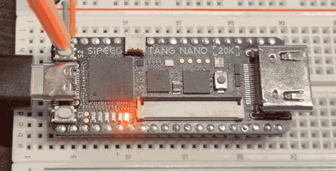
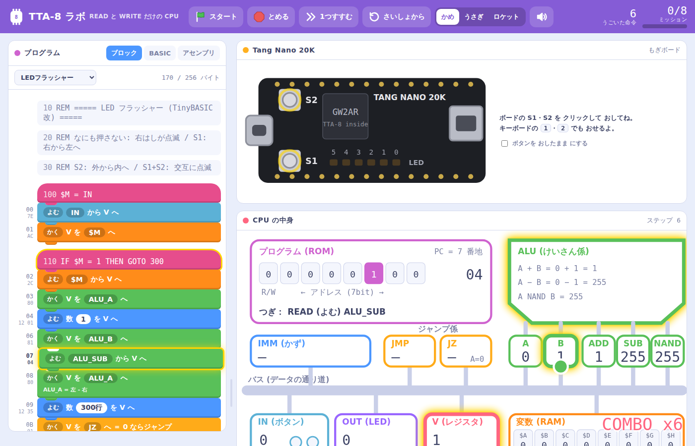

# TTA-8 ― 命令が 2つしかない 8bit CPU を 作ろう！

<p align="center">
  
</p>

<p align="center"><b>READ（よむ）と WRITE（かく）。命令は この 2つだけ。<br>
それなのに、たし算も、くりかえしも、ボタンで 動きを 変えることも できる。</b></p>

---

## これは なに？

**TTA-8** は、小学生・中学生でも しくみが ぜんぶ わかる ように 作った **8bit の 小さな CPU** です。

- **CPU の 設計図は たった 51行**（Verilog、コメントを のぞく）
- **本物の FPGA ボード**（Sipeed Tang Nano 20K）の 中で 動く
- **ブラウザで 1命令ずつ 見られる デバッガ**「TTA-8 ラボ」つき
- **TinyBASIC改** で プログラムが 書ける
- しかも **チューリング完全**（どんな 計算でも できる）

## どうやって 計算するの？

CPU の 中には、数を 1つだけ 運べる「はこびや」**V** が います。

```
READ  IMM, 3      ; V に 3 を 入れる
WRITE ALU_A       ; けいさん係の A に わたす
READ  IMM, 5      ; V に 5 を 入れる
WRITE ALU_B       ; けいさん係の B に わたす
READ  ALU_ADD     ; 答え（8）を 受け取る
WRITE OUT         ; LED に 出す → __○___ (8 = 001000)
```

計算するのは **部品の 方**。V は 運ぶだけ。
これが **TTA（Transport Triggered Architecture ＝ 運ぶと 動く しくみ）** です。

## ブラウザで ためそう（ボードが なくても OK）

**[▶ TTA-8 ラボを ひらく](https://tjm8874.github.io/TTA-8/debugger/)**（インストール なし。ダウンロードした 人は `debugger/index.html` を ダブルクリック）

<p align="center"></p>

V が 数を 運ぶ ようすが アニメーションで 見えます。ミッションを クリアして ほしを 集めよう。

## ボードで 動かそう（3ステップ）

| | Windows | Mac |
|---|---|---|
| ① じゅんび（1回だけ） | `FPGA_Tool/Windows/0_setup_driver.bat` | `bash FPGA_Tool/Mac/0_setup.sh` |
| ② ボードを 確認 | `1_check_board.bat` | `bash 1_check_board.sh` |
| ③ 書きこむ！ | `2_write_sram.bat` | `bash 2_write_sram.sh` |

S1・S2 ボタンを おすと、LED の 光りかたが 変わります。

## せつめい書

**[せつめい書を 読む](docs/guide/README.md)**　（[Web 版](https://tjm8874.github.io/TTA-8/docs/guide/)・[PDF 版](docs/guide/TTA-8_guide.pdf)）

| 章 | |
|---|---|
| [1. CPU って なんだろう？](docs/guide/01_cpu.md) | [6. TinyBASIC改 で プログラムを 書こう](docs/guide/06_basic.md) |
| [2. TTA-8 の しくみ](docs/guide/02_tta8.md) | [7. アセンブリで 書いてみよう](docs/guide/07_asm.md) |
| [3. じゅんびしよう](docs/guide/03_setup.md) | [8. CPU の 設計図を 読もう](docs/guide/08_verilog.md) |
| [4. 動かしてみよう](docs/guide/04_run.md) | [9. AI に こうやって たのもう](docs/guide/09_ai.md) |
| [5. TTA-8 ラボで 中を のぞこう](docs/guide/05_lab.md) | [10. つぎの ぼうけんへ](docs/guide/10_next.md) |

## 紹介動画

<p align="center">
  <a href="https://youtu.be/1pB3R3t_cCU"></a>
</p>

**[▶ YouTube で 見る](https://youtu.be/1pB3R3t_cCU)**（約2分。CPU の 基本 → READ/WRITE で 計算 → 本物の ボードで 動かす まで）

X（旧 Twitter）での 紹介：https://x.com/tjm8874/status/2105184836227125601

## 使うもの

- **Sipeed Tang Nano 20K**（FPGA ボード）
- データ通信できる **USB-C ケーブル**
- **Windows** か **Mac** の パソコン
- あれば **ブレッドボード**

## フォルダ

```
hdl/        CPU の 設計図 (tta8.v) と ボード用の ファイル
debugger/   TTA-8 ラボ (index.html)
programs/   サンプル (.bas / .asm)
tools/      アセンブラ・BASIC コンパイラ・エミュレータ
FPGA_Tool/  書きこみ・ビルド用の 道具 (Windows / Mac)
docs/       せつめい書・仕様書・文法書・動画の 台本
```

仕様：[docs/architecture.md](docs/architecture.md)　文法：[docs/tinybasic.md](docs/tinybasic.md)

---

<p align="center"><b>ブレッドボードが あれば、このボードの 外がわに 色々な 回路を 付けられる。<br>
おれたちの ぼうけん（電子工作）は これからだ！</b></p>
