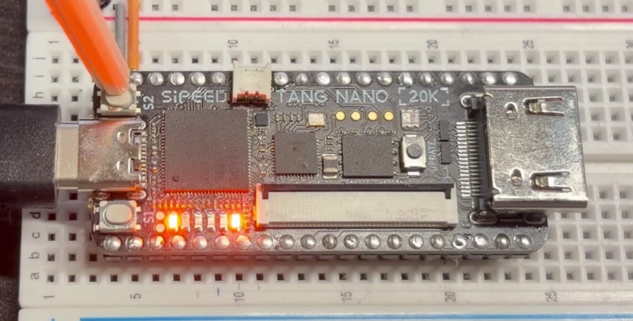

# 1. CPU って なんだろう？

## CPU は「命令を 1つずつ こなす 係」

ゲーム機、スマホ、パソコン、電子レンジ……。
その 中には **CPU（シーピーユー）** という 部品が 入っています。

CPU が やることは、じつは とても 単純です。

1. つぎの 命令を 読む
2. その 命令を やる
3. 1 に もどる

これを 1秒間に 何十億回も くりかえしているので、
ゲームが 動いたり、動画が 見られたり するのです。

> **プログラム** とは、CPU に やってほしい 命令を 順番に ならべた ものです。
> 料理の レシピ みたいな ものですね。

## コンピューターの 中は ぜんぶ「数」

CPU は 文字も 絵も 音も、ぜんぶ **数** として あつかいます。
しかも その 数は **0 と 1 だけ** で 書かれています。これを **2進数（にしんすう）** と いいます。

LED を 6こ ならべて、光っている ところを 1、消えている ところを 0 と すると……

| LED | 2進数 | ふつうの 数 |
|---|---|---|
| `_____○` | 000001 | 1 |
| `____○_` | 000010 | 2 |
| `____○○` | 000011 | 3 |
| `○_○_○_` | 101010 | 42 |
| `○○○○○○` | 111111 | 63 |

右はしが 1、そのとなりが 2、つぎが 4、8、16、32 …と、
左へ 行くたびに **2倍** に なります。
`101010` は 32 + 8 + 2 = **42** です。

## 8bit って？

0 か 1 が 入る 1マスを **ビット（bit）** と いいます。
**8bit** は 8マス なので、`00000000`（0）から `11111111`（255）まで、
**256 とおりの 数** を あらわせます。

この せつめい書で 作る CPU「**TTA-8**」は、8bit の 数を あつかう CPU です。
255 に 1を たすと、あふれて 0 に もどります（車の メーターが 一周するのと 同じ）。

## FPGA は「回路を 書きかえられる チップ」

ふつうの CPU は、工場で 作られた あとは 中身を 変えられません。
でも **FPGA（エフピージーエー）** という チップは、
**設計図を 書きこむと、その とおりの 回路に 変身** します。

Tang Nano 20K に のっている FPGA に、
TTA-8 の 設計図（Verilog という ことばで 書いたもの）を 書きこむと、
FPGA の 中に **ほんものの CPU** が できあがります。

TTA-8 は **1秒に 1000命令** の ゆっくりした CPU です。
ゆっくりなので、LED の 動きを 目で 追いかけることが できます。

---
[← もくじ](README.md)　|　[つぎへ → 2. TTA-8 の しくみ](02_tta8.md)
