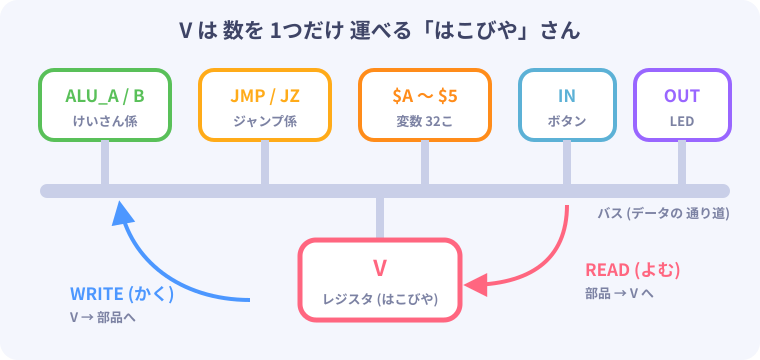
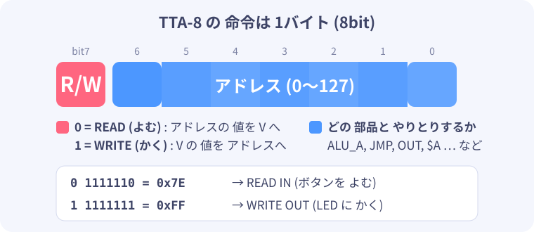
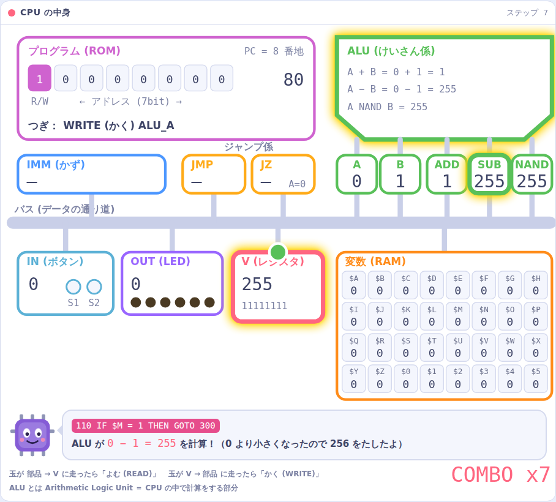

# 2. TTA-8 の しくみ

## 命令は 2つだけ！

ふつうの CPU には「たし算」「ジャンプ」「比べる」など、
何十〜何百 種類もの 命令が あります。

TTA-8 の 命令は、なんと **2つだけ** です。

| 命令 | 読みかた | すること |
|---|---|---|
| **READ** | よむ | 部品から 数を 1つ 受け取って、**V** に 入れる |
| **WRITE** | かく | **V** に 入っている 数を、部品に わたす |

**V（ブイ）** は、数を 1つだけ 持てる「はこびや」さんです（**レジスタ** と いいます）。



「え、それだけで 計算できるの？」と 思いますよね。
ひみつは **部品の 方が 仕事を する** ことです。
けいさん係（ALU）に 数を わたすと、答えが すぐに 用意されます。
V は それを 取りに 行くだけ。
このような CPU を **TTA（Transport Triggered Architecture ＝ 運ぶと 動く しくみ）** と いいます。

## 命令の 形



命令の指定は 8bit（1バイト）です。`READ IMM` だけは、次の1バイトに数を置くので、合計2バイトを使います。
いちばん 左の 1bit で READ か WRITE かを えらび、
のこりの 7bit で「どの 部品と やりとりするか」（**アドレス**）を えらびます。

## 部品と アドレスの 一覧（アドレスマップ）

| アドレス | 名前 | READ（よむ）と… | WRITE（かく）と… |
|---|---|---|---|
| 0x00 | **ALU_A** | A の 数 | A に 数を 入れる |
| 0x01 | **ALU_B** | B の 数 | B に 数を 入れる |
| 0x02 | **ALU_ADD** | A + B の 答え | ― |
| 0x03 | **ALU_NAND** | A NAND B の 答え | ― |
| 0x04 | **ALU_SUB** | A − B の 答え | ― |
| 0x10 | **JMP** | ― | その 番地へ ジャンプ |
| 0x11 | **JZ** | ― | A が 0 の ときだけ ジャンプ |
| 0x12 | **IMM** | 命令の つぎに 書いた 数 | ― |
| 0x20〜0x3F | **$A〜$Z、$0〜$5** | 変数の 数 | 変数に 数を 入れる |
| 0x7E | **IN** | ボタン（S1＝1、S2＝2、両方＝3） | ― |
| 0x7F | **OUT** | ― | LED に 出す（1 の ビットが 光る） |

> `0x` が ついた 数は **16進数** です。0x10 は 16、0x7F は 127 の ことです。

**ALU（エーエルユー）** は Arithmetic Logic Unit（算術論理演算装置）の ことで、
CPU の 中で 計算を する 係です。

## 3 + 5 を 計算してみよう

```
READ  IMM, 3      ; V に 3 を 入れる
WRITE ALU_A       ; A = 3
READ  IMM, 5      ; V に 5 を 入れる
WRITE ALU_B       ; B = 5
READ  ALU_ADD     ; V = A + B = 8
WRITE OUT         ; LED に 8 を 出す → 001000
```

V が 数を 運んでいるだけなのに、ちゃんと 足し算が できました。
LED には 8（2進数で `001000`）が 光ります。

## ジャンプも「書くだけ」

CPU は **PC（プログラムカウンター）** という 番号で「実行する命令の バイト番地」を おぼえています。
ふつうは 1つずつ 進みますが、

- **JMP に 書く** と、PC が その 数に なります（＝ジャンプ）
- **JZ に 書く** と、**ALU_A が 0 の ときだけ** ジャンプします

JZ が あるので「0 に なるまで くりかえす」「ボタンが 押されていたら こっちへ」
といった **判断** が できます。
[発展1](11_calculation.md) では、この仕組みで わり算や論理演算を組み立てます。

## CPU の 中身 まとめ



- **PC**：実行する命令の バイト番地（8bit）
- **V**：数を 運ぶ はこびや（8bit）
- **プログラム（ROM）**：命令と定数を合わせて 256バイトまで 入る
- **変数（RAM）**：$A〜$Z と $0〜$5 の 32こ（起動・リセット時はすべて0）
- **ALU**：A と B から たし算・ひき算・NAND を 計算
- **IN / OUT**：ボタンと LED

これで ぜんぶです。CPU の 設計図は、コメントと 空行を のぞくと **たった 53行** です。

---
[← 1. CPU って なんだろう？](01_cpu.md)　|　[つぎへ → 3. じゅんびしよう](03_setup.md)
