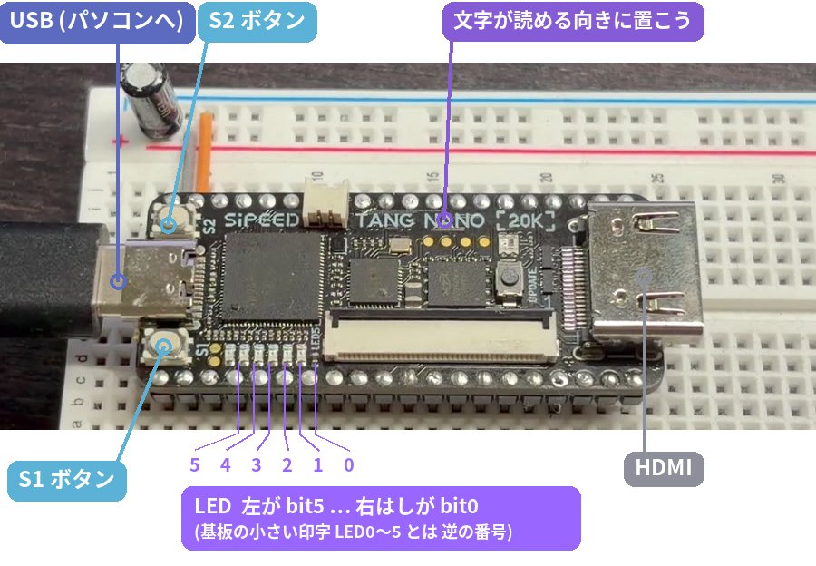
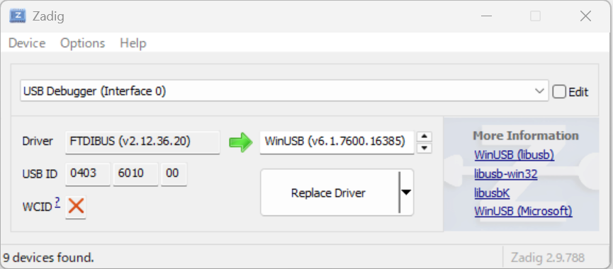
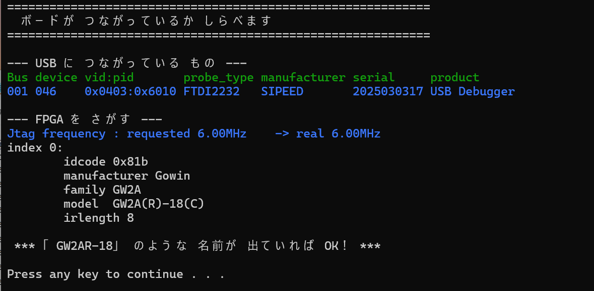

# 3. じゅんびしよう

## 用意するもの

| もの | ポイント |
|---|---|
| **Sipeed Tang Nano 20K** | FPGA ボード。通販で 買えます |
| **USB ケーブル**（USB-C） | **データ通信ができる もの**。充電専用だと ボードが 見えません |
| **パソコン** | Windows 10 / 11 か Mac |
| ブレッドボード（あれば） | ボードを さして おくと 安定します。[10章](10_next.md) の ぼうけんにも 使います |

## ① このプロジェクトを ダウンロードする

1. GitHub の このプロジェクトの ページ（https://github.com/tjm8874/TTA-8）を 開く
2. 緑の **「Code」** ボタン → **「Download ZIP」**
3. ZIP を 開いて（展開して）、すきな 場所に おく

中身は こうなっています。

```
TTA-8-main/        ← ZIP を 開くと この 名前（TTA-8 に 変えても OK）
├ FPGA_Tool/      ← ボードに 書きこむ 道具（ダブルクリックで 使う）
│  ├ Windows/
│  └ Mac/
├ debugger/       ← TTA-8 ラボ（index.html を ブラウザで 開く）
├ hdl/            ← CPU の 設計図（Verilog）と 書きこむ ファイル
├ programs/       ← サンプルプログラム
└ docs/           ← この せつめい書
```

## ② ボードの 向きを おぼえよう



**「TANG NANO 20K」の 文字が 読める 向き**（USB が 左）で 置きます。
この向きで、LED は **右はしが bit0**、左はしが bit5 です。
プログラムで `OUT 1` と すると、右はしの LED が 光ります。

> 基板には 小さく LED0〜LED5 と 印字されていますが、この プロジェクトでは
> 2進数と 合わせるために **逆の 番号（右はしが 0）** を 使います。

## ③ Windows の じゅんび（はじめに 1回だけ）

`FPGA_Tool\Windows` を 開きます。

### 0_setup_driver.bat … USB ドライバの 設定

ボードに 書きこむ 道具（openFPGALoader）が ボードと 話せるように、
**Zadig（ザディグ）** という 道具で ドライバを 入れかえます。

1. ボードを USB で つなぐ
2. `0_setup_driver.bat` を ダブルクリック → 何か キーを おすと Zadig が 開く
3. 「このアプリが 変更を 加えることを 許可しますか」→ **はい**
4. メニューの **Options → List All Devices** に チェック
5. リストから **USB Debugger (Interface 0)** を えらぶ
   - 下の **USB ID が `0403 6010 00`** に なっていれば 正解
   - **Interface 1 は えらばない**
6. 右がわが **WinUSB** に なっているのを 確認して **Replace Driver**



7. 「successfully」と 出たら 完了

> **リストに 出ないときは**：「不明な USB デバイス」しか 出ない ときは、
> ケーブルが 充電専用 かもしれません。べつの ケーブルに かえるか、
> パソコン本体の USB に 直接 さして みてください。

### 1_check_board.bat … ボードが 見えるか 確認

ダブルクリックして、**model GW2A(R)-18(C)** と 出れば OK です。



## ④ Mac の じゅんび（はじめに 1回だけ）

Mac では ドライバの 設定は いりません。
「ターミナル」を 開いて、`FPGA_Tool/Mac` の 中で つぎを 実行します。

```
bash 0_setup.sh         # openFPGALoader を 入れる（Homebrew が 必要）
bash 1_check_board.sh   # ボードが 見えるか 確認
```

> ファイルを ターミナルの 画面に ドラッグ＆ドロップすると、場所を 打たなくて すみます。
> Homebrew が ない ときは、[9章](09_ai.md) の やりかたで AI に 聞いてみよう。

---
[← 2. TTA-8 の しくみ](02_tta8.md)　|　[つぎへ → 4. 動かしてみよう](04_run.md)
