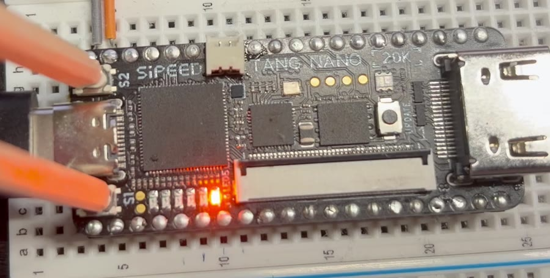
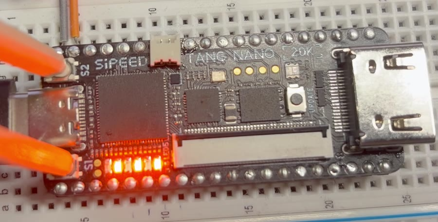
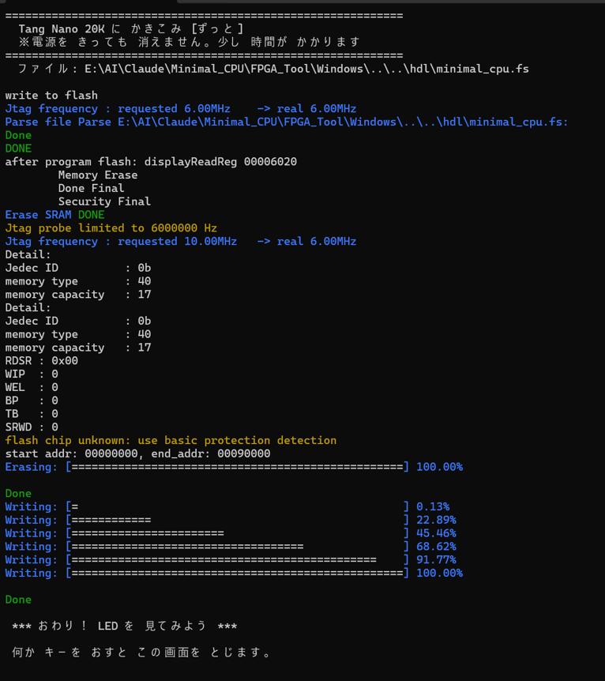
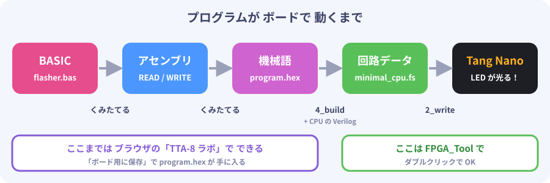

# 4. 動かしてみよう

## 書きこみかたは 2しゅるい

| ファイル（Windows / Mac） | どうなる？ | いつ 使う？ |
|---|---|---|
| `2_write_sram.bat` / `.sh` | **おためし**。電源を 切ると 消える | 何度も ためす とき |
| `3_write_flash.bat` / `.sh` | **ずっと**。電源を 切っても のこる | 完成した とき |

さいしょは **おためし** で やってみましょう。

## LED フラッシャーを 書きこもう

1. ボードを USB で つなぐ
2. `FPGA_Tool\Windows\2_write_sram.bat` を ダブルクリック（Mac は `bash 2_write_sram.sh`）
3. **「おわり！ LED を 見てみよう」** と 出たら 成功

最初から 入っている `hdl/minimal_cpu.fs` には、**LED フラッシャー** の プログラムが 入っています。

## ボタンを おしてみよう

| おす ボタン | LED の 動き（0.5秒ごと） |
|---|---|
| なし | 右はしが 点滅　`_____○` ⇔ `______` |
| **S1** | 光が 右から 左へ 流れる　`_____○` → `____○_` → … → `○_____` |
| **S2** | 外から 内へ　`○____○` → `_○__○_` → `__○○__` |
| **S1 と S2** | 交互に 点滅　`○_○_○_` ⇔ `_○_○_○` |

 

左：なにも おさない とき（右はしが 点滅）　右：S1 と S2 を いっしょに おした とき

## 電源を 切っても 動くように する

`3_write_flash.bat` で 書きこむと、USB を ぬいて さしなおしても 同じ プログラムが 動きます。
少し 時間が かかりますが、さいごに **Done** と **おわり！** が 出れば OK です。

> 黄色い 文字で `flash chip unknown` と 出ますが、問題 ありません。

## 自分の プログラムを 書きこむには

ボードの 中身は **CPU（Verilog）＋ プログラム（program.hex）** で できています。
プログラムを 変えたら、**CPU と いっしょに くみたて直す（ビルドする）** ひつようが あります。

1. [5章](05_lab.md) の **TTA-8 ラボ** で プログラムを 作り、**「ボード用に保存」** を おす → `program.hex` が 保存される
2. `program.hex` を **`4_build.bat` の 上に ドラッグ＆ドロップ**（Mac は `bash 4_build.sh program.hex`）
   - 自動で `hdl/program.hex` に コピーされて、ビルドが 始まります
   - **はじめての ときだけ**、ビルド道具（OSS CAD Suite、約600MB）を ダウンロードします
3. **「できた！」** と 出たら、`2_write_sram.bat` で 書きこむ

---
[← 3. じゅんびしよう](03_setup.md)　|　[つぎへ → 5. TTA-8 ラボで 中を のぞこう](05_lab.md)
