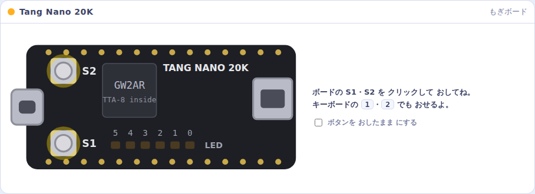
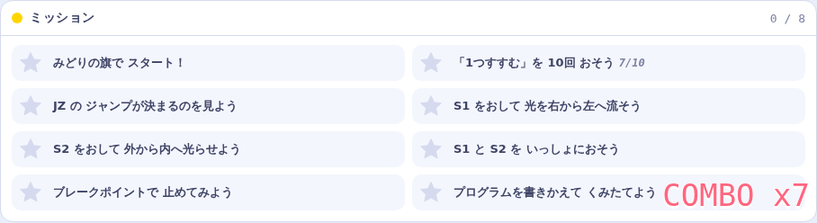

# 5. TTA-8 ラボで 中を のぞこう

**TTA-8 ラボ** は、ブラウザで 動く TTA-8 の デバッガです。
ボードが なくても、CPU の 中で 何が 起きているかを 1命令ずつ 見られます。

`debugger/index.html` を ダブルクリックすると、ブラウザで 開きます（インターネットは いりません）。

## 画面の 見かた

| 場所 | 見えるもの |
|---|---|
| 左：**プログラム** | ブロック・BASIC・アセンブリの 3つの 見かたで プログラムを 表示 |
| 右上：**もぎボード** | Tang Nano 20K の まね。S1・S2 を クリックで おせる |
| 右中：**CPU の 中身** | PC・V・ALU・変数・IN・OUT が いまの 値と いっしょに 見える |
| 右下：**ミッション** | クリアすると ほしが もらえる |

## 動かしかた

| ボタン | キー | すること |
|---|---|---|
| **スタート**（みどりの旗） | スペース | 動かす |
| **とめる** | | 止める |
| **1つすすむ** | → | 1命令だけ 進める |
| **さいしょから** | | リセット |
| **かめ / うさぎ / ロケット** | | 速さ。**ロケット** は 本物の ボードと 同じ 1秒に 1000命令 |

**1つすすむ** を おすと、V が 部品から 部品へ 数を 運ぶ ようすが、
バス（データの 通り道）を 走る 玉で 見えます。

- 玉が **部品 → V** に 走ったら **READ（よむ）**
- 玉が **V → 部品** に 走ったら **WRITE（かく）**

キャラクターが「いま 何を したか」を ことばで 教えてくれます。

## もぎボード

本物の ボードと 同じ 向き・同じ 位置に、S1・S2・LED が あります。
キーボードの **1**・**2** でも ボタンを おせます。
「ボタンを おしたまま にする」に チェックすると、両方を おしたままに できます。

## ブレークポイント

プログラムの 行の 左はしを クリックすると、そこで 止まる しるし（**ブレークポイント**）が つきます。
ロケットで 走らせて、気になる ところで 止めてみましょう。

## ミッション

「1つすすむを 10回 おそう」「JZ の ジャンプが 決まるのを 見よう」など、8つの ミッションが あります。
ぜんぶ クリアできるかな？

## プログラムを 書きかえる

- **BASIC** タブ → **かきかえる** → 書きかえて **くみたてる**
- **アセンブリ** タブ → 書きかえて **くみたてる**
- できたら **ボード用に保存** で `program.hex` を 保存 → [4章](04_run.md#自分の-プログラムを-書きこむには) の やりかたで ボードへ

---
[← 4. 動かしてみよう](04_run.md)　|　[つぎへ → 6. TinyBASIC改 で プログラムを 書こう](06_basic.md)
