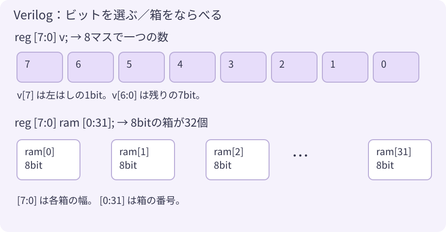
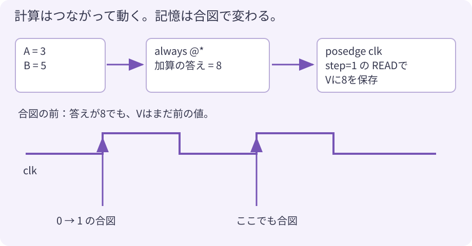

# 8. CPU の 設計図を 読もう

ここまで、READ と WRITE を 使って プログラムを 動かしてきました。
今度は、その命令を 実行する回路を 読みます。設計図は `hdl/tta8.v`。
**Verilog（ベリログ）** という 回路を 書くことばで、コメントと 空行を のぞくと **53行** です。

## ① 8bit の箱と、箱のならびを 用意する

```verilog
reg [7:0] v;
reg [7:0] ram [0:31];
```

`[7:0]` は「7番から 0番までの 8マス」。`v` は 数を運ぶための 箱です。
`ram [0:31]` は、その 8bit の箱を **32個** ならべる指定です。
`ram[3]` と書けば 3番の箱を 選べます。番号は 0 からなので、4個目です。



| 書き方 | このCPUでの役目 |
|---|---|
| `reg [7:0] v;` | クロックの合図で 値を覚える V |
| `reg [7:0] pc;` | 実行する命令の **バイト番地** を覚える PC |
| `reg [7:0] alu_a, alu_b;` | 計算に使う A と B を覚える |
| `reg [7:0] rom [0:255];` | プログラム用の 256バイトの配列 |
| `wire [7:0] inst = rom[pc];` | PC が選んだ命令を `inst` という名前で 取り出す |

V は「数を運ぶ専用」のレジスタです。PC や ALU_A・ALU_B も 値を覚える部品です。
なお、`reg` と書くだけで 必ず記憶回路になるわけではありません。
**どの `always` の中で、どう値を決めるか** も関係します。次の図で 区別しましょう。

## ② 「いつも計算」と「合図で保存」を 分ける



```verilog
always @* begin
    rdata = alu_a + alu_b;
end
```

これは 説明用に 足し算だけを 抜き出した例です。
`always @*` は、使っている値が変わると 答えも変わる回路を表します。
A が 3、B が 5 なら、少しの回路の遅れのあとで 答えは 8 になります。
実際のCPUでは `case` を使い、足し算・引き算・ほかの部品の どれを読むかも 選びます。

```verilog
always @(posedge clk) begin
    if (step) v <= rdata;
end
```

こちらは、クロックが **0 から 1 に変わる瞬間** に 値を保存する回路です。
`posedge` は この立ち上がりを指します。さらに `step` が 1 のときだけ 保存します。
実際のCPUでは READ のときに V へ保存し、WRITE のときは 書き込み先へ保存します。

`=` は この例では「計算中の値を決める」、`<=` は「合図の直前の値を使い、保存する値を予約する」書き方です。
この `<=` は「以下」という比較ではありません。

たとえば、同じクロック処理の中に 次の2行が あったとします。

```verilog
v <= rdata;
alu_a <= v;
```

合図の直前が `v = 3`、`rdata = 8` なら、更新後は **V が 8、A が 3** になります。
上の行で予約した 8 を、下の行がすぐ使うわけではありません。
TTA-8 では READ と WRITE を別々の命令にしているので、この2つの保存を 1命令では行いません。

## ③ 命令のビットを 分けて、読む相手を選ぶ

```verilog
wire [7:0] inst = rom[pc];
wire       write = inst[7];
wire [6:0] addr = inst[6:0];
```

`inst[7]` は 左はしの1bit。`inst[6:0]` は 残りの7bitです。
`write` が 0 なら READ、1 なら WRITE。`addr` が 相手の番号です。

```verilog
case (addr)
    7'h00: rdata = alu_a;
    7'h01: rdata = alu_b;
    7'h02: rdata = alu_a + alu_b;
    7'h03: rdata = ~(alu_a & alu_b);
    7'h04: rdata = alu_a - alu_b;
    7'h12: rdata = rom[pc + 8'd1];
    7'h7E: rdata = {6'b0, btn};
    default: rdata = is_ram ? ram[addr[4:0]] : 8'h00;
endcase
```

`case` は 番号ごとに 選ぶものを分けます。`default` は どの番号にも当たらないときです。
最後の行の `条件 ? はい : いいえ` は、RAM の番号なら RAM を読み、それ以外なら 0 を選びます。

| 記号 | 読み方 |
|---|---|
| `7'h12` | 7bitで表した 16進数の12（10進数では18） |
| `8'd1` | 8bitで表した 10進数の1 |
| `&` / `~` | ビットごとの AND / 0と1の反転 |
| `{6'b0, btn}` | 6個の0と、2bitのボタンの値をつないで 8bitにする |
| `==` / `!` | 等しいかを調べる / 条件を反対にする |

ALU の答えは、A と B が変われば変わります。
READ は、その時点で用意されている答えを V に覚えます。

## ④ クロックごとの変化を 追ってみよう

[2章](02_tta8.md) の足し算を、0番地から入れた場合です。
`READ IMM` は 命令と数で2バイト、ほかは1バイトです。

| 合図 | 実行前のPC | 実行する命令 | 実行後のV | 実行後のA / B | 次のPC |
|---|---:|---|---:|---|---:|
| 1 | 0 | READ IMM, 3 | 3 | 0 / 0 | 2 |
| 2 | 2 | WRITE ALU_A | 3 | 3 / 0 | 3 |
| 3 | 3 | READ IMM, 5 | 5 | 3 / 0 | 5 |
| 4 | 5 | WRITE ALU_B | 5 | 3 / 5 | 6 |
| 5 | 6 | READ ALU_ADD | 8 | 3 / 5 | 7 |
| 6 | 7 | WRITE OUT | 8 | 3 / 5 | 8 |

4回目の合図で B が 5 になると、加算回路の答えは 8 になります。
5回目の合図で その8を V に保存し、6回目で LED に渡します。
WRITE のあとも V の値は残っています。

> **予想してみよう**：3回目のあとで止めたとき、V と A は同じ値でしょうか？
> 表をかくして考え、ラボに [2章](02_tta8.md) の命令を入れて確かめよう。

## ⑤ PC を進める予約と、ジャンプの予約

```verilog
pc <= pc + 8'd1;
// WRITE JMP の場合は、このあとで
pc <= v;
```

同じ `always` の中で、同じ合図に対して 同じレジスタへ複数の `<=` を実行すると、
**あとに実行した代入が採用されます**。だから JMP のときは `pc + 1` の代わりに V が次のPCになります。
別々の `always` から同じレジスタへ書く、という意味ではありません。

JZ では `if (alu_a == 0)` が成り立ったときだけ `pc <= v` を実行します。
A が 0 でなければ 最初の `pc + 1` が残り、次へ進みます。
`READ IMM` の場合は `pc + 2` に予約し直して、数が入ったバイトを飛ばします。

## ⑥ リセットで、32個の変数も 0 にする

```verilog
integer i;
// always @(posedge clk) の中
if (reset) begin
    pc <= 0; v <= 0; alu_a <= 0; alu_b <= 0; led <= 0;
    for (i = 0; i < 32; i = i + 1) ram[i] <= 0;
end
```

`for` は 0番から31番まで、各箱を指定するための繰り返しです。
この回路では **1回のクロックの合図で、32個すべてを0にします**。
CPU が32命令かけて消すプログラムではありません。

実際のコードは `if (reset) ... else if (step) ...` なので、リセットを優先します。
`step` が 0 でも、リセット中のクロックで初期化されます。
起動時も再リセット時も変数は0になり、ラボの「さいしょから」と揃います。

## ⑦ ボードと つなぐ

`hdl/top_tangnano20k.v` は、ボードとCPUを つなぐファイルです。

- 電源を入れた直後は リセットする。
- 27MHz のクロックを数えて、1秒に1000回だけ `step` を1にする。
- ボタンの信号を クロックに合わせて受け取る。
- LED は 0で光るので、出力を `~led` で反転する。

ピンの対応は `hdl/tangnano20k.cst` に書いてあります。
CPU は27MHzのクロックを受けますが、命令を実行するのは `step` が1の合図だけです。

「この回路だけで わり算もできるの？」は [発展1](11_calculation.md)、
「箱や番地を増やしたい！」は [発展2](12_expansion.md) で試して考えます。

---
[← 7. アセンブリで 書いてみよう](07_asm.md)　|　[つぎへ → 9. AI に こうやって たのもう](09_ai.md)
