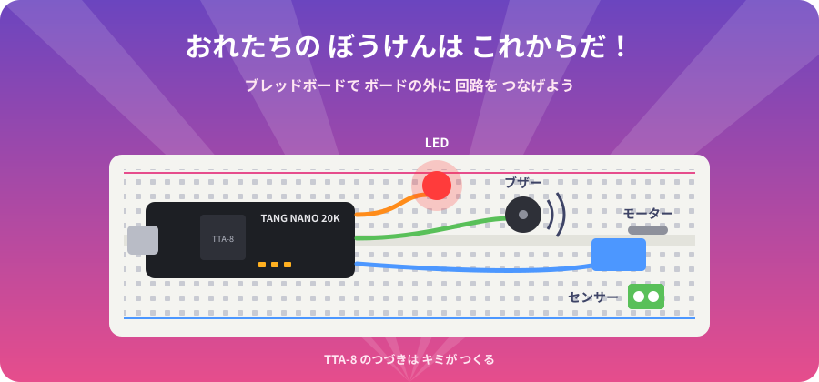

# 10. つぎの ぼうけんへ

ここまで 読んだ キミは、

- CPU が **命令を 1つずつ こなす** しくみ
- **READ と WRITE だけ** でも 計算・判断・くりかえしが できる こと
- その CPU を **FPGA の 中に 作って 動かす** 方法

を 知っています。これは 大人の エンジニアでも しっかり 説明できる 人が 少ない ことです。

## ブレッドボードで 回路を ふやそう

Tang Nano 20K の まわりには、たくさんの **ピン（足）** が ならんでいます。
ブレッドボードに させば、ボードの **外がわに いろいろな 回路を つなげられます**。

| つなぐもの | できること | TTA-8 の 改造アイデア |
|---|---|---|
| LED を もっと | 8こ、16こ の イルミネーション | OUT を 8bit に ふやす |
| ボタン・スイッチ | 入力を ふやす | IN に ビットを 足す |
| ブザー | 音を 鳴らす | 新しい アドレスに「音」の 部品を 作る |
| 7セグメント LED | 数字を 表示する | 変数の 中身を 数字で 見る |
| モーター・サーボ | ものを 動かす | ロボットの 頭脳に する |
| 温度・光センサー | まわりの ようすを 読む | センサーの 値で LED の 色を 変える |

TTA-8 に 部品を 足すのは かんたんです。
**新しい アドレスを 決めて、READ か WRITE で つなぐだけ**。
それが TTA（運ぶと 動く しくみ）の いいところです。

> 回路を つなぐ ときは、**USB を ぬいてから**。
> Tang Nano 20K の ピンは **3.3V** です。5V の 部品を つなぐ ときは 大人と いっしょに 調べよう。

## チャレンジ リスト

- [ ] LED フラッシャーに 新しい 模様を 足す
- [ ] 2進数カウンターを 0.1秒ごとに する
- [ ] かけ算の 答えが 63 を こえたら どうなるか 予想して ためす
- [ ] ALU に「かけ算」の 部品を 足して、アドレス 0x05 で 読めるように する
- [ ] ブザーを つないで、ボタンで ドレミを 鳴らす
- [ ] 自分で 考えた 命令セットの CPU を 作る

## ブレッドボードが あれば、このボードの 外がわに 色々な 回路を 付けられる。

# おれたちの ぼうけん（電子工作）は これからだ！

---
[← 9. AI に こうやって たのもう](09_ai.md)　|　[ふろく →](appendix.md)　|　[もくじ](README.md)
