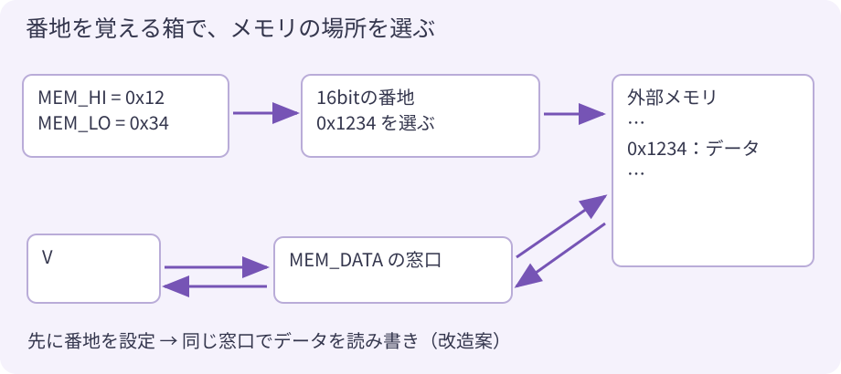
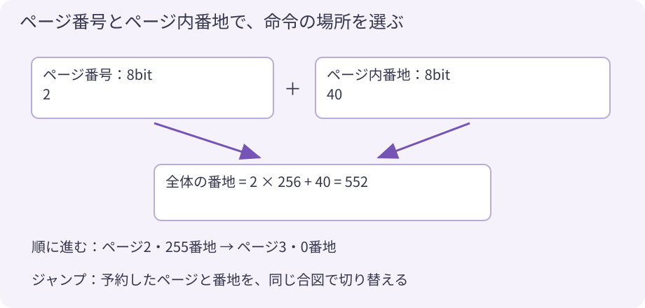

# 発展2. CPU の箱と番地を 大きくするには？

ここは **回路を改造するときの設計メモ** です。以下の新しいポートや仕組みは、現行のTTA-8とラボには まだありません。
そのまま入力して動くサンプルではなく、「どこを変える必要があるか」を考える補題です。

## 16bitにしたら、何が変わる？

8bitの数の箱を16bitにすると、0〜65,535を一つの箱に入れられます。
ただし `v` の宣言だけを変えても、ほかの8bitの箱へ渡した時点で上位の桁が落ちます。

| 大きくする部分 | 一緒に考えること |
|---|---|
| V、ALU_A、ALU_B、RAMの各要素 | 計算結果とデータの通り道も16bitに揃える |
| 定数の読み込み | 今の IMM は後続1バイト。大きな数を2バイトで読むなら、順序とPCの進み方を決める |
| LEDへの出力 | 今は下位6bitだけ。16bit化してもLEDが自動で増えるわけではない |
| PCとプログラムROM | データ幅とは別に決める。Vを16bitにしてもプログラム容量は自動では増えない |
| アセンブラ、BASIC、ラボ | 数の範囲、命令の長さ、表示、計算結果の扱いを揃える |

命令を8bitのままにして、運ぶデータだけ16bitにする設計もできます。
IMMを後続2バイトに変える案なら、命令1バイト＋定数2バイトで、次のPCは3進みます。
既存のプログラムは新しい形式で作り直します。

## 外のメモリには「番地の箱」と「データの窓口」を作る

今のRAMは32個で、命令に書いた番号で直接選びます。
外のメモリをたくさん読み書きするなら、先に **アクセスしたい番地をレジスタに覚えさせる** 方法があります。
ここでは、この番地を覚える箱をアドレスインデックスレジスタと呼びます。



たとえば8bitデータのまま、番地用に8bitの箱を二つ作ります。

| 新しく作るポートの例 | WRITE | READ |
|---|---|---|
| MEM_LO | 番地の下位8bitを保存 | 下位8bitを読む |
| MEM_HI | 番地の上位8bitを保存 | 上位8bitを読む |
| MEM_DATA | 選んだ番地へデータを書く | 選んだ番地のデータを読む |

```asm
; 改造後の使い方の案（現行版では動きません）
READ  IMM, 0x12
WRITE MEM_HI
READ  IMM, 0x34
WRITE MEM_LO
READ  MEM_DATA       ; メモリの 0x1234 番地を V へ
WRITE $A
```

16bitの番地なら 65,536か所を選べます。1か所1バイトなら64KiBです。
命令の7bitアドレスは、この **窓口の番号** を選ぶために使います。
窓口が少なくても、その先の場所は多く選べるわけです。

ただし外付けメモリには、信号を出す回路やピン、読み書きのタイミング制御も必要です。
応答が間に合わないときはCPUを待たせます。その間に同じWRITEを何度も発行しない仕組みも必要です。
番地を覚える箱だけを追加すれば、メモリがつながるわけではありません。

> **考えよう**：READのあとに番地を1増やす機能があれば、連続したデータを読むプログラムはどう短くなるでしょう？

## 入出力も「選ぶ窓口」と「使う窓口」に分けられる

同じ考え方で `IO_INDEX` と `IO_DATA` を作れます。
先に `IO_INDEX` へ装置の番号を書き、`IO_DATA` でその装置を読み書きします。
番号を受け取る選択回路が、LED・ブザー・センサーなどへ振り分けます。

8bitの番号なら256か所、16bitなら65,536か所を選べます。
**命令に直接書ける128個のポート数を超えて拡張できる** のが利点です。
容量は番号の幅や接続先の回路で決まり、物理ピンや通信速度にも限りがあります。
外部の通信回路を使って装置を増やす場合は、その通信手順も作ります。

## プログラムは、ページ番号とページ内番地で選ぶ

今は8bitのPCだけなので、0〜255番地です。
256バイトを1ページとして、上位に8bitのページ番号を付ければ、256ページを選べます。
全部で65,536バイト、64KiBのプログラム空間になります。



通常の実行では、ページ内番地255の次は、次ページの0番地へ進めます。
`READ IMM` がページ末尾に来た場合も、次のページから定数を読み、全体のPCを2進める設計にします。
ページ255の末尾を超えた場合にどうするかも決めます。

ジャンプ先の上位と下位を別々に書くなら、**途中で命令を読むページだけが切り替わらないように** します。
一つの案は「次のジャンプ先ページ」の箱を別に用意することです。

```asm
; 改造後の設計案。NEXT_PAGE は予約するだけ
READ  IMM, 2
WRITE NEXT_PAGE
READ  IMM, 40
WRITE JMP           ; ここでページ2・番地40へ同時に切り替える
```

JZなら、条件が成立したときだけページと番地を同時に切り替えます。
成立しなければ今のページの次の命令へ進みます。
この案では毎回ジャンプ前にページを指定する約束にし、予約値の取り違えを防ぎます。
ラベルをこの命令列に翻訳する処理も、アセンブラ側に必要です。

ページ番号を固定の窓へ切り替える「バンク切り替え」という別案もあります。
どちらを選んでも、ROM本体・PCの更新・IMM・ジャンプ・ツールを 一緒に設計します。

## 改造は、一つずつラボと回路を揃える

最初の改造には、[10章](10_next.md) の演算を一つ追加する課題が向いています。
そのあとで、次のように範囲を広げられます。

1. FPGA内部の小さなRAMに インデックスでアクセスする。
2. 選ぶ番号を増やし、ラボと回路で同じ読み書きになるか確かめる。
3. 応答を待つ仕組みを作ってから、外付けメモリへ進む。
4. プログラムをページ化し、ページ境界のIMMと条件分岐を試す。

これらの拡張は「今のCPUを理解する」ための必須条件ではありません。
今ある制限が、どの箱や配線の幅から来ているかを説明できたら、設計を変える入口に立っています。

---
[← 発展1. 計算を組み立てる](11_calculation.md)　|　[つぎへ → ふろく](appendix.md)
